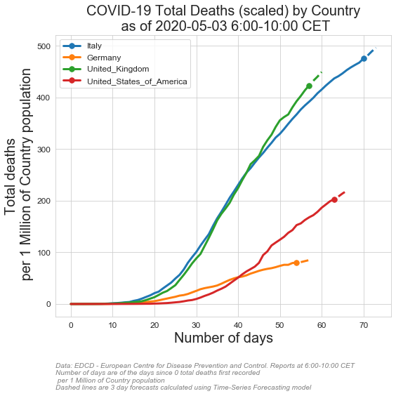
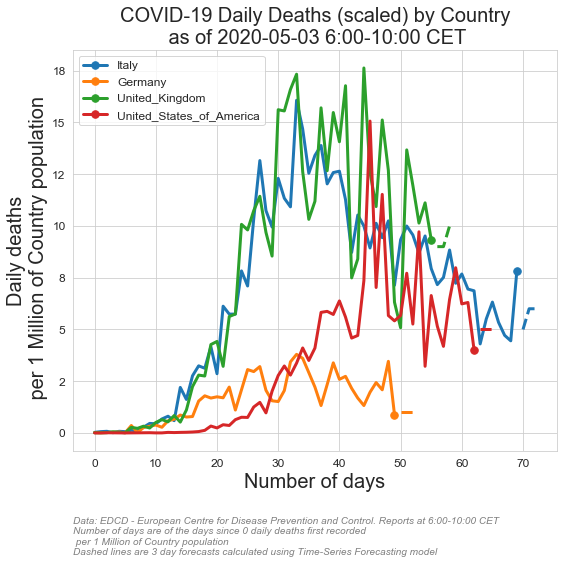
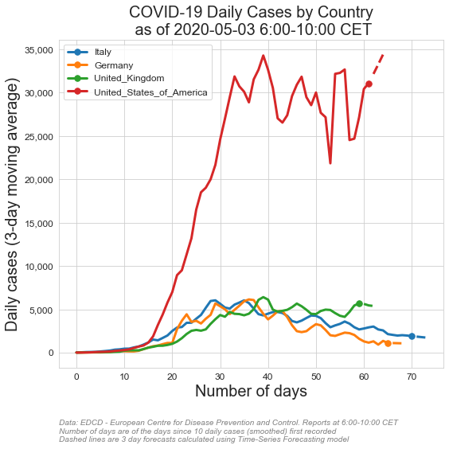

# COVID-19 Corona Pandemic DATA VISUALIZATION AND FORECASTING
# with time series models including
# -(Seasonal) Autoregressive integrated moving average
# -Holt-Winters Forecasting


# Country selection codes:
       #  'AFG', 'ALB', 'AND', 'DZA', 'AGO', nan, 'ATG', 'ARG', 'ARM', 'ABW',
       # 'AUS', 'AUT', 'AZE', 'BHS', 'BHR', 'BGD', 'BRB', 'BLR', 'BEL',
       # 'BLZ', 'BEN', 'BMU', 'BTN', 'BOL', 'BIH', 'BWA', 'BRA', 'VGB',
       # 'BRN', 'BGR', 'BFA', 'BDI', 'KHM', 'CMR', 'CAN', 'CPV', 'CYM',
       # 'CAF', 'TCD', 'CHL', 'CHN', 'COL', 'COG', 'CRI', 'CIV', 'HRV',
       # 'CUB', 'CUW', 'CYP', 'CZE', 'COD', 'DNK', 'DJI', 'DMA', 'DOM',
       # 'ECU', 'EGY', 'SLV', 'GNQ', 'ERI', 'EST', 'SWZ', 'ETH', 'FRO',
       # 'FJI', 'FIN', 'FRA', 'PYF', 'GAB', 'GMB', 'GEO', 'DEU', 'GHA',
       # 'GIB', 'GRC', 'GRL', 'GRD', 'GUM', 'GTM', 'GGY', 'GIN', 'GNB',
       # 'GUY', 'HTI', 'VAT', 'HND', 'HUN', 'ISL', 'IND', 'IDN', 'IRN',
       # 'IRQ', 'IRL', 'IMN', 'ISR', 'ITA', 'JAM', 'JPN', 'JEY', 'JOR',
       # 'KAZ', 'KEN', 'XKX', 'KWT', 'KGZ', 'LAO', 'LVA', 'LBN', 'LBR',
       # 'LBY', 'LIE', 'LTU', 'LUX', 'MDG', 'MWI', 'MYS', 'MDV', 'MLI',
       # 'MLT', 'MRT', 'MUS', 'MEX', 'MDA', 'MCO', 'MNG', 'MNE', 'MSR',
       # 'MAR', 'MOZ', 'MMR', 'NAM', 'NPL', 'NLD', 'NCL', 'NZL', 'NIC',
       # 'NER', 'NGA', 'MKD', 'MNP', 'NOR', 'OMN', 'PAK', 'PSE', 'PAN',
       # 'PNG', 'PRY', 'PER', 'PHL', 'POL', 'PRT', 'PRI', 'QAT', 'ROU',
       # 'RUS', 'RWA', 'KNA', 'LCA', 'VCT', 'SMR', 'SAU', 'SEN', 'SRB',
       # 'SYC', 'SLE', 'SGP', 'SXM', 'SVK', 'SVN', 'SOM', 'ZAF', 'KOR',
       # 'ESP', 'LKA', 'SDN', 'SUR', 'SWE', 'CHE', 'SYR', 'TWN', 'THA',
       # 'TLS', 'TGO', 'TTO', 'TUN', 'TUR', 'TCA', 'UGA', 'UKR', 'ARE',
       # 'GBR', 'TZA', 'USA', 'VIR', 'URY', 'UZB', 'VEN', 'VNM', 'ZMB',
       # 'ZWE','WORLD'    
# Country selection codes:
       #  'AFG', 'ALB', 'AND', 'DZA', 'AGO', nan, 'ATG', 'ARG', 'ARM', 'ABW',
       # 'AUS', 'AUT', 'AZE', 'BHS', 'BHR', 'BGD', 'BRB', 'BLR', 'BEL',
       # 'BLZ', 'BEN', 'BMU', 'BTN', 'BOL', 'BIH', 'BWA', 'BRA', 'VGB',
       # 'BRN', 'BGR', 'BFA', 'BDI', 'KHM', 'CMR', 'CAN', 'CPV', 'CYM',
       # 'CAF', 'TCD', 'CHL', 'CHN', 'COL', 'COG', 'CRI', 'CIV', 'HRV',
       # 'CUB', 'CUW', 'CYP', 'CZE', 'COD', 'DNK', 'DJI', 'DMA', 'DOM',
       # 'ECU', 'EGY', 'SLV', 'GNQ', 'ERI', 'EST', 'SWZ', 'ETH', 'FRO',
       # 'FJI', 'FIN', 'FRA', 'PYF', 'GAB', 'GMB', 'GEO', 'DEU', 'GHA',
       # 'GIB', 'GRC', 'GRL', 'GRD', 'GUM', 'GTM', 'GGY', 'GIN', 'GNB',
       # 'GUY', 'HTI', 'VAT', 'HND', 'HUN', 'ISL', 'IND', 'IDN', 'IRN',
       # 'IRQ', 'IRL', 'IMN', 'ISR', 'ITA', 'JAM', 'JPN', 'JEY', 'JOR',
       # 'KAZ', 'KEN', 'XKX', 'KWT', 'KGZ', 'LAO', 'LVA', 'LBN', 'LBR',
       # 'LBY', 'LIE', 'LTU', 'LUX', 'MDG', 'MWI', 'MYS', 'MDV', 'MLI',
       # 'MLT', 'MRT', 'MUS', 'MEX', 'MDA', 'MCO', 'MNG', 'MNE', 'MSR',
       # 'MAR', 'MOZ', 'MMR', 'NAM', 'NPL', 'NLD', 'NCL', 'NZL', 'NIC',
       # 'NER', 'NGA', 'MKD', 'MNP', 'NOR', 'OMN', 'PAK', 'PSE', 'PAN',
       # 'PNG', 'PRY', 'PER', 'PHL', 'POL', 'PRT', 'PRI', 'QAT', 'ROU',
       # 'RUS', 'RWA', 'KNA', 'LCA', 'VCT', 'SMR', 'SAU', 'SEN', 'SRB',
       # 'SYC', 'SLE', 'SGP', 'SXM', 'SVK', 'SVN', 'SOM', 'ZAF', 'KOR',
       # 'ESP', 'LKA', 'SDN', 'SUR', 'SWE', 'CHE', 'SYR', 'TWN', 'THA',
       # 'TLS', 'TGO', 'TTO', 'TUN', 'TUR', 'TCA', 'UGA', 'UKR', 'ARE',
       # 'GBR', 'TZA', 'USA', 'VIR', 'URY', 'UZB', 'VEN', 'VNM', 'ZMB',
       # 'ZWE','WORLD'    
      
# chart story selection list:
        # 'Total_cases'
        # 'Total_deaths'
        # 'Daily_cases'
        # 'Daily_deaths'
        # 'Daily_cases_MovAvg'
        # 'Daily_deaths_MovAvg'
        # 'Daily_cases_MovAvg_perPopulation'
        # 'Daily_deaths_MovAvg_perPopulation'
        #'Total_cases_perPopulation'
        #'Total_deaths_perPopulation'
        #'Daily_cases_perPopulation'
        #'Daily_deaths_perPopulation'
        #'Ratio_of_total_deaths_to_total_cases'
PubDate='2020-04-14' # pubdate of the data file by European Centre for Disease Prevention and Control
# original data link: https://www.ecdc.europa.eu/en/publications-data/download-todays-data-geographic-distribution-covid-19-cases-worldwide
forecast_flag=True  
forecast_mdl=['hwes','hwes','sarimax','hwes'] #options are ['hwes','sarimax']
loga=False #take log of data
plot_figures_flag=True
save_figures_flag=True
verbose=True
show_mdl_detail=False
mawindow=3 #moving average window size for smoothing charts
fdays=3 # number of steps forecasts (forward  time points) 
case_thr=10 # the day threshold that the first N cases recorded
deat_thr=3 # the day threshold that the first N deaths recorded
caseperpop_thr=0
deatperpop_thr=0
country_list=['ITA','DEU','GBR','USA']
 


```python
new_dict1=RUNcoviddatastory('Total_cases',PubDate,country_list,case_thr,mawindow,fdays,loga,forecast_flag,forecast_mdl,plot_figures_flag,save_figures_flag,verbose,show_mdl_detail)        
```

    ITA
    Total_cases
    2020-04-14    162732
    2020-04-15    166014
    2020-04-16    169362
    Freq: D, Name: hwes_model, dtype: int32
    DEU
    Total_cases
    2020-04-14    127480
    2020-04-15    129907
    2020-04-16    132381
    Freq: D, Name: hwes_model, dtype: int32
    GBR
    Total_cases
    2020-04-14     93560
    2020-04-15     98379
    2020-04-16    103075
    Freq: D, Name: sarimax_model, dtype: int32
    USA
    Total_cases
    2020-04-14    608741
    2020-04-15    636061
    2020-04-16    664607
    Freq: D, Name: hwes_model, dtype: int32
    


```python
new_dict2=RUNcoviddatastory('Total_deaths',PubDate,country_list,deat_thr,mawindow,fdays,loga,forecast_flag,forecast_mdl,plot_figures_flag,save_figures_flag,verbose,show_mdl_detail)        

```

    ITA
    Total_deaths
    2020-04-14    21004
    2020-04-15    21564
    2020-04-16    22139
    Freq: D, Name: hwes_model, dtype: int32
    DEU
    Total_deaths
    2020-04-14    3143
    2020-04-15    3328
    2020-04-16    3524
    Freq: D, Name: hwes_model, dtype: int32
    GBR
    Total_deaths
    2020-04-14    12017
    2020-04-15    12670
    2020-04-16    13287
    Freq: D, Name: sarimax_model, dtype: int32
    USA
    Total_deaths
    2020-04-14    25297
    2020-04-15    27060
    2020-04-16    28946
    Freq: D, Name: hwes_model, dtype: int32
    


```python
new_dict3=RUNcoviddatastory('Ratio_of_total_deaths_to_total_cases',PubDate,country_list,caseperpop_thr,mawindow,fdays,loga,False,forecast_mdl,plot_figures_flag,save_figures_flag,verbose,show_mdl_detail)        
```


```python
new_dict4=RUNcoviddatastory('Total_cases_perPopulation',PubDate,country_list,caseperpop_thr,mawindow,fdays,loga,forecast_flag,forecast_mdl,plot_figures_flag,save_figures_flag,verbose,show_mdl_detail)        

```

    ITA
    Total_cases_perPopulation
    2020-04-14    2692
    2020-04-15    2747
    2020-04-16    2802
    Freq: D, Name: hwes_model, dtype: int32
    DEU
    Total_cases_perPopulation
    2020-04-14    1537
    2020-04-15    1566
    2020-04-16    1596
    Freq: D, Name: hwes_model, dtype: int32
    GBR
    Total_cases_perPopulation
    2020-04-14    1389
    2020-04-15    1470
    2020-04-16    1528
    Freq: D, Name: sarimax_model, dtype: int32
    USA
    Total_cases_perPopulation
    2020-04-14    1860
    2020-04-15    1944
    2020-04-16    2031
    Freq: D, Name: hwes_model, dtype: int32
    


```python
new_dict5=RUNcoviddatastory('Total_deaths_perPopulation',PubDate,country_list,deatperpop_thr,mawindow,fdays,loga,forecast_flag,forecast_mdl,plot_figures_flag,save_figures_flag,verbose,show_mdl_detail)        

```

    ITA
    Total_deaths_perPopulation
    2020-04-14    347
    2020-04-15    356
    2020-04-16    366
    Freq: D, Name: hwes_model, dtype: int32
    DEU
    Total_deaths_perPopulation
    2020-04-14    37
    2020-04-15    40
    2020-04-16    42
    Freq: D, Name: hwes_model, dtype: int32
    GBR
    Total_deaths_perPopulation
    2020-04-14    180
    2020-04-15    190
    2020-04-16    200
    Freq: D, Name: sarimax_model, dtype: int32
    USA
    Total_deaths_perPopulation
    2020-04-14    77
    2020-04-15    82
    2020-04-16    88
    Freq: D, Name: hwes_model, dtype: int32
    





```python
new_dict6=RUNcoviddatastory('Daily_cases',PubDate,country_list,case_thr,mawindow,fdays,loga,forecast_flag,forecast_mdl,plot_figures_flag,save_figures_flag,verbose,show_mdl_detail)        

```

    ITA
    Daily_cases
    2020-04-14    3241
    2020-04-15    3101
    2020-04-16    2967
    Freq: D, Name: hwes_model, dtype: int32
    DEU
    Daily_cases
    2020-04-14    2876
    2020-04-15    2637
    2020-04-16    2418
    Freq: D, Name: hwes_model, dtype: int32
    GBR
    Daily_cases
    2020-04-14    5129
    2020-04-15    5497
    2020-04-16    5286
    Freq: D, Name: sarimax_model, dtype: int32
    USA
    Daily_cases
    2020-04-14    23652
    2020-04-15    22013
    2020-04-16    20487
    Freq: D, Name: hwes_model, dtype: int32
    


```python
new_dict7=RUNcoviddatastory('Daily_deaths',PubDate,country_list,deat_thr,mawindow,fdays,loga,forecast_flag,forecast_mdl,plot_figures_flag,save_figures_flag,verbose,show_mdl_detail)        

```

    ITA
    Daily_deaths
    2020-04-14    513
    2020-04-15    504
    2020-04-16    495
    Freq: D, Name: hwes_model, dtype: int32
    DEU
    Daily_deaths
    2020-04-14    172
    2020-04-15    178
    2020-04-16    183
    Freq: D, Name: hwes_model, dtype: int32
    GBR
    Daily_deaths
    2020-04-14    720
    2020-04-15    707
    2020-04-16    694
    Freq: D, Name: sarimax_model, dtype: int32
    USA
    Daily_deaths
    2020-04-14    1574
    2020-04-15    1609
    2020-04-16    1645
    Freq: D, Name: hwes_model, dtype: int32
    


```python
new_dict8=RUNcoviddatastory('Daily_cases_perPopulation',PubDate,country_list,caseperpop_thr,mawindow,fdays,loga,forecast_flag,forecast_mdl,plot_figures_flag,save_figures_flag,verbose,show_mdl_detail)        

```

    ITA
    Daily_cases_perPopulation
    2020-04-14    53
    2020-04-15    51
    2020-04-16    49
    Freq: D, Name: hwes_model, dtype: int32
    DEU
    Daily_cases_perPopulation
    2020-04-14    26
    2020-04-15    23
    2020-04-16    21
    Freq: D, Name: hwes_model, dtype: int32
    GBR
    Daily_cases_perPopulation
    2020-04-14    77
    2020-04-15    84
    2020-04-16    80
    Freq: D, Name: sarimax_model, dtype: int32
    USA
    Daily_cases_perPopulation
    2020-04-14    78
    2020-04-15    79
    2020-04-16    80
    Freq: D, Name: hwes_model, dtype: int32
    


```python
new_dict9=RUNcoviddatastory('Daily_deaths_perPopulation',PubDate,country_list,deatperpop_thr,mawindow,fdays,loga,forecast_flag,forecast_mdl,plot_figures_flag,save_figures_flag,verbose,show_mdl_detail)        

```

    ITA
    Daily_deaths_perPopulation
    2020-04-14    8
    2020-04-15    8
    2020-04-16    8
    Freq: D, Name: hwes_model, dtype: int32
    DEU
    Daily_deaths_perPopulation
    2020-04-14    1
    2020-04-15    1
    2020-04-16    1
    Freq: D, Name: hwes_model, dtype: int32
    GBR
    Daily_deaths_perPopulation
    2020-04-14    10
    2020-04-15    10
    2020-04-16    10
    Freq: D, Name: sarimax_model, dtype: int32
    USA
    Daily_deaths_perPopulation
    2020-04-14    4
    2020-04-15    4
    2020-04-16    5
    Freq: D, Name: hwes_model, dtype: int32
    





```python
new_dict10=RUNcoviddatastory('Daily_cases_MovAvg',PubDate,country_list,case_thr,mawindow,fdays,loga,forecast_flag,forecast_mdl,plot_figures_flag,save_figures_flag,verbose,show_mdl_detail)        

```

    ITA
    Daily_cases_MovAvg
    2020-04-14    3732
    2020-04-15    3497
    2020-04-16    3277
    Freq: D, Name: hwes_model, dtype: int32
    DEU
    Daily_cases_MovAvg
    2020-04-14    2170
    2020-04-15    1900
    2020-04-16    1663
    Freq: D, Name: hwes_model, dtype: int32
    GBR
    Daily_cases_MovAvg
    2020-04-14    5686
    2020-04-15    5451
    2020-04-16    5397
    Freq: D, Name: sarimax_model, dtype: int32
    USA
    Daily_cases_MovAvg
    2020-04-14    24076
    2020-04-15    21398
    2020-04-16    19018
    Freq: D, Name: hwes_model, dtype: int32
    





```python
new_dict11=RUNcoviddatastory('Daily_deaths_MovAvg',PubDate,country_list,deat_thr,mawindow,fdays,loga,forecast_flag,forecast_mdl,plot_figures_flag,save_figures_flag,verbose,show_mdl_detail)        

```

    ITA
    Daily_deaths_MovAvg
    2020-04-14    525
    2020-04-15    513
    2020-04-16    501
    Freq: D, Name: hwes_model, dtype: int32
    DEU
    Daily_deaths_MovAvg
    2020-04-14    141
    2020-04-15    141
    2020-04-16    140
    Freq: D, Name: hwes_model, dtype: int32
    GBR
    Daily_deaths_MovAvg
    2020-04-14    717
    2020-04-15    682
    2020-04-16    676
    Freq: D, Name: sarimax_model, dtype: int32
    USA
    Daily_deaths_MovAvg
    2020-04-14    1460
    2020-04-15    1313
    2020-04-16    1180
    Freq: D, Name: hwes_model, dtype: int32
    


```python
new_dict12=RUNcoviddatastory('Daily_cases_MovAvg_perPopulation',PubDate,country_list,caseperpop_thr,mawindow,fdays,loga,forecast_flag,forecast_mdl,plot_figures_flag,save_figures_flag,verbose,show_mdl_detail)        

```

    ITA
    Daily_cases_MovAvg_perPopulation
    2020-04-14    61
    2020-04-15    57
    2020-04-16    54
    Freq: D, Name: hwes_model, dtype: int32
    DEU
    Daily_cases_MovAvg_perPopulation
    2020-04-14    26
    2020-04-15    22
    2020-04-16    19
    Freq: D, Name: hwes_model, dtype: int32
    GBR
    Daily_cases_MovAvg_perPopulation
    2020-04-14    85
    2020-04-15    82
    2020-04-16    81
    Freq: D, Name: sarimax_model, dtype: int32
    USA
    Daily_cases_MovAvg_perPopulation
    2020-04-14    73
    2020-04-15    65
    2020-04-16    58
    Freq: D, Name: hwes_model, dtype: int32
    


```python
new_dict13=RUNcoviddatastory('Daily_deaths_MovAvg_perPopulation',PubDate,country_list,deatperpop_thr,mawindow,fdays,loga,forecast_flag,forecast_mdl,plot_figures_flag,save_figures_flag,verbose,show_mdl_detail)        
```

    ITA
    Daily_deaths_MovAvg_perPopulation
    2020-04-14    8
    2020-04-15    8
    2020-04-16    8
    Freq: D, Name: hwes_model, dtype: int32
    DEU
    Daily_deaths_MovAvg_perPopulation
    2020-04-14    1
    2020-04-15    1
    2020-04-16    1
    Freq: D, Name: hwes_model, dtype: int32
    GBR
    Daily_deaths_MovAvg_perPopulation
    2020-04-14    10
    2020-04-15    10
    2020-04-16    10
    Freq: D, Name: sarimax_model, dtype: int32
    USA
    Daily_deaths_MovAvg_perPopulation
    2020-04-14    4
    2020-04-15    4
    2020-04-16    3
    Freq: D, Name: hwes_model, dtype: int32
    


```python

```

