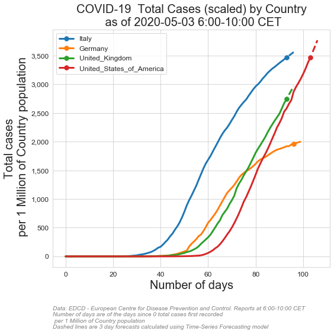
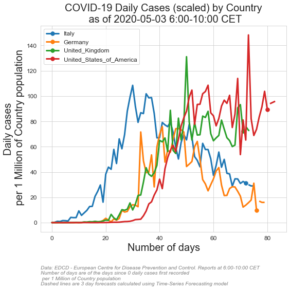

# COVID-19 Corona Pandemic DATA VISUALIZATION AND FORECASTING
# with time series models including
# -(Seasonal) Autoregressive integrated moving average
# -Holt-Winters Forecasting


# Country selection codes:
       #  'AFG', 'ALB', 'AND', 'DZA', 'AGO', nan, 'ATG', 'ARG', 'ARM', 'ABW',
       # 'AUS', 'AUT', 'AZE', 'BHS', 'BHR', 'BGD', 'BRB', 'BLR', 'BEL',
       # 'BLZ', 'BEN', 'BMU', 'BTN', 'BOL', 'BIH', 'BWA', 'BRA', 'VGB',
       # 'BRN', 'BGR', 'BFA', 'BDI', 'KHM', 'CMR', 'CAN', 'CPV', 'CYM',
       # 'CAF', 'TCD', 'CHL', 'CHN', 'COL', 'COG', 'CRI', 'CIV', 'HRV',
       # 'CUB', 'CUW', 'CYP', 'CZE', 'COD', 'DNK', 'DJI', 'DMA', 'DOM',
       # 'ECU', 'EGY', 'SLV', 'GNQ', 'ERI', 'EST', 'SWZ', 'ETH', 'FRO',
       # 'FJI', 'FIN', 'FRA', 'PYF', 'GAB', 'GMB', 'GEO', 'DEU', 'GHA',
       # 'GIB', 'GRC', 'GRL', 'GRD', 'GUM', 'GTM', 'GGY', 'GIN', 'GNB',
       # 'GUY', 'HTI', 'VAT', 'HND', 'HUN', 'ISL', 'IND', 'IDN', 'IRN',
       # 'IRQ', 'IRL', 'IMN', 'ISR', 'ITA', 'JAM', 'JPN', 'JEY', 'JOR',
       # 'KAZ', 'KEN', 'XKX', 'KWT', 'KGZ', 'LAO', 'LVA', 'LBN', 'LBR',
       # 'LBY', 'LIE', 'LTU', 'LUX', 'MDG', 'MWI', 'MYS', 'MDV', 'MLI',
       # 'MLT', 'MRT', 'MUS', 'MEX', 'MDA', 'MCO', 'MNG', 'MNE', 'MSR',
       # 'MAR', 'MOZ', 'MMR', 'NAM', 'NPL', 'NLD', 'NCL', 'NZL', 'NIC',
       # 'NER', 'NGA', 'MKD', 'MNP', 'NOR', 'OMN', 'PAK', 'PSE', 'PAN',
       # 'PNG', 'PRY', 'PER', 'PHL', 'POL', 'PRT', 'PRI', 'QAT', 'ROU',
       # 'RUS', 'RWA', 'KNA', 'LCA', 'VCT', 'SMR', 'SAU', 'SEN', 'SRB',
       # 'SYC', 'SLE', 'SGP', 'SXM', 'SVK', 'SVN', 'SOM', 'ZAF', 'KOR',
       # 'ESP', 'LKA', 'SDN', 'SUR', 'SWE', 'CHE', 'SYR', 'TWN', 'THA',
       # 'TLS', 'TGO', 'TTO', 'TUN', 'TUR', 'TCA', 'UGA', 'UKR', 'ARE',
       # 'GBR', 'TZA', 'USA', 'VIR', 'URY', 'UZB', 'VEN', 'VNM', 'ZMB',
       # 'ZWE','WORLD'    
      
# chart story selection list:
        # 'Total_cases'
        # 'Total_deaths'
        # 'Daily_cases'
        # 'Daily_deaths'
        # 'Daily_cases_MovAvg'
        # 'Daily_deaths_MovAvg'
        # 'Daily_cases_MovAvg_perPopulation'
        # 'Daily_deaths_MovAvg_perPopulation'
        #'Total_cases_perPopulation'
        #'Total_deaths_perPopulation'
        #'Daily_cases_perPopulation'
        #'Daily_deaths_perPopulation'

# original data link: #https://www.ecdc.europa.eu/en/publications-data/download-todays-data-geographic-distribution-covid-19-cases-worldwide
PubDate='2020-04-13' # pubdate of the data file by European Centre for Disease Prevention and Control
forecast_flag=True  
forecast_mdl=['hwes','hwes','sarimax','hwes'] #options are ['hwes','sarimax']
loga=False #take log of data
plot_figures_flag=True
save_figures_flag=True
verbose=True
show_mdl_detail=False
mawindow=3 #moving average window size for smoothing charts
fdays=3 # number of steps forecasts (forward  time points) 
case_thr=10 # the day threshold that the first N cases recorded
deat_thr=3 # the day threshold that the first N deaths recorded
caseperpop_thr=0
deatperpop_thr=0
country_list=['ITA','DEU','GBR','USA']
 


```python
new_dict1=RUNcoviddatastory('Total_cases',PubDate,country_list,case_thr,mawindow,fdays,loga,forecast_flag,forecast_mdl,plot_figures_flag,save_figures_flag,verbose,show_mdl_detail)        
```

    ITA
    Total_cases
    2020-04-13    160565
    2020-04-14    164880
    2020-04-15    169311
    Freq: D, Name: hwes_model, dtype: int32
    DEU
    Total_cases
    2020-04-13    125938
    2020-04-14    128931
    2020-04-15    131994
    Freq: D, Name: hwes_model, dtype: int32
    GBR
    Total_cases
    2020-04-13     90142
    2020-04-14     95906
    2020-04-15    101569
    Freq: D, Name: sarimax_model, dtype: int32
    USA
    Total_cases
    2020-04-13    586630
    2020-04-14    617203
    2020-04-15    649370
    Freq: D, Name: hwes_model, dtype: int32
    


```python
new_dict1=RUNcoviddatastory('Total_deaths',PubDate,country_list,deat_thr,mawindow,fdays,loga,forecast_flag,forecast_mdl,plot_figures_flag,save_figures_flag,verbose,show_mdl_detail)        

```

    ITA
    Total_deaths
    2020-04-13    20398
    2020-04-14    20888
    2020-04-15    21390
    Freq: D, Name: hwes_model, dtype: int32
    DEU
    Total_deaths
    2020-04-13    2934
    2020-04-14    3075
    2020-04-15    3223
    Freq: D, Name: hwes_model, dtype: int32
    GBR
    Total_deaths
    2020-04-13    11355
    2020-04-14    12063
    2020-04-15    12737
    Freq: D, Name: sarimax_model, dtype: int32
    USA
    Total_deaths
    2020-04-13    23717
    2020-04-14    25443
    2020-04-15    27295
    Freq: D, Name: hwes_model, dtype: int32
    


```python
new_dict1=RUNcoviddatastory('Total_cases_perPopulation',PubDate,country_list,caseperpop_thr,mawindow,fdays,loga,forecast_flag,forecast_mdl,plot_figures_flag,save_figures_flag,verbose,show_mdl_detail)        

```

    ITA
    Total_cases_perPopulation
    2020-04-13    2656
    2020-04-14    2728
    2020-04-15    2801
    Freq: D, Name: hwes_model, dtype: int32
    DEU
    Total_cases_perPopulation
    2020-04-13    1518
    2020-04-14    1554
    2020-04-15    1590
    Freq: D, Name: hwes_model, dtype: int32
    GBR
    Total_cases_perPopulation
    2020-04-13    1385
    2020-04-14    1495
    2020-04-15    1602
    Freq: D, Name: sarimax_model, dtype: int32
    USA
    Total_cases_perPopulation
    2020-04-13    1793
    2020-04-14    1886
    2020-04-15    1984
    Freq: D, Name: hwes_model, dtype: int32
    


```python
new_dict1=RUNcoviddatastory('Total_deaths_perPopulation',PubDate,country_list,deatperpop_thr,mawindow,fdays,loga,forecast_flag,forecast_mdl,plot_figures_flag,save_figures_flag,verbose,show_mdl_detail)        

```

    ITA
    Total_deaths_perPopulation
    2020-04-13    337
    2020-04-14    345
    2020-04-15    354
    Freq: D, Name: hwes_model, dtype: int32
    DEU
    Total_deaths_perPopulation
    2020-04-13    35
    2020-04-14    37
    2020-04-15    38
    Freq: D, Name: hwes_model, dtype: int32
    GBR
    Total_deaths_perPopulation
    2020-04-13    170
    2020-04-14    181
    2020-04-15    191
    Freq: D, Name: sarimax_model, dtype: int32
    USA
    Total_deaths_perPopulation
    2020-04-13    72
    2020-04-14    77
    2020-04-15    83
    Freq: D, Name: hwes_model, dtype: int32
    





```python
new_dict1=RUNcoviddatastory('Daily_cases',PubDate,country_list,case_thr,mawindow,fdays,loga,forecast_flag,forecast_mdl,plot_figures_flag,save_figures_flag,verbose,show_mdl_detail)        

```

    ITA
    Daily_cases
    2020-04-13    4304
    2020-04-14    4366
    2020-04-15    4429
    Freq: D, Name: hwes_model, dtype: int32
    DEU
    Daily_cases
    2020-04-13    3428
    2020-04-14    3202
    2020-04-15    2991
    Freq: D, Name: hwes_model, dtype: int32
    GBR
    Daily_cases
    2020-04-13    7712
    2020-04-14    7154
    2020-04-15    7079
    Freq: D, Name: sarimax_model, dtype: int32
    USA
    Daily_cases
    2020-04-13    26760
    2020-04-14    25430
    2020-04-15    24167
    Freq: D, Name: hwes_model, dtype: int32
    


```python
new_dict1=RUNcoviddatastory('Daily_deaths',PubDate,country_list,deat_thr,mawindow,fdays,loga,forecast_flag,forecast_mdl,plot_figures_flag,save_figures_flag,verbose,show_mdl_detail)        

```

    ITA
    Daily_deaths
    2020-04-13    497
    2020-04-14    480
    2020-04-15    463
    Freq: D, Name: hwes_model, dtype: int32
    DEU
    Daily_deaths
    2020-04-13    123
    2020-04-14    120
    2020-04-15    117
    Freq: D, Name: hwes_model, dtype: int32
    GBR
    Daily_deaths
    2020-04-13    778
    2020-04-14    766
    2020-04-15    754
    Freq: D, Name: sarimax_model, dtype: int32
    USA
    Daily_deaths
    2020-04-13    1532
    2020-04-14    1565
    2020-04-15    1599
    Freq: D, Name: hwes_model, dtype: int32
    


```python
new_dict1=RUNcoviddatastory('Daily_cases_perPopulation',PubDate,country_list,caseperpop_thr,mawindow,fdays,loga,forecast_flag,forecast_mdl,plot_figures_flag,save_figures_flag,verbose,show_mdl_detail)        

```

    ITA
    Daily_cases_perPopulation
    2020-04-13    71
    2020-04-14    72
    2020-04-15    73
    Freq: D, Name: hwes_model, dtype: int32
    DEU
    Daily_cases_perPopulation
    2020-04-13    33
    2020-04-14    31
    2020-04-15    28
    Freq: D, Name: hwes_model, dtype: int32
    GBR
    Daily_cases_perPopulation
    2020-04-13     76
    2020-04-14    120
    2020-04-15     82
    Freq: D, Name: sarimax_model, dtype: int32
    USA
    Daily_cases_perPopulation
    2020-04-13    86
    2020-04-14    88
    2020-04-15    90
    Freq: D, Name: hwes_model, dtype: int32
    


```python
new_dict1=RUNcoviddatastory('Daily_deaths_perPopulation',PubDate,country_list,deatperpop_thr,mawindow,fdays,loga,forecast_flag,forecast_mdl,plot_figures_flag,save_figures_flag,verbose,show_mdl_detail)        

```

    ITA
    Daily_deaths_perPopulation
    2020-04-13    8
    2020-04-14    7
    2020-04-15    7
    Freq: D, Name: hwes_model, dtype: int32
    DEU
    Daily_deaths_perPopulation
    2020-04-13    1
    2020-04-14    1
    2020-04-15    1
    Freq: D, Name: hwes_model, dtype: int32
    GBR
    Daily_deaths_perPopulation
    2020-04-13    11
    2020-04-14    11
    2020-04-15    11
    Freq: D, Name: sarimax_model, dtype: int32
    USA
    Daily_deaths_perPopulation
    2020-04-13    4
    2020-04-14    4
    2020-04-15    4
    Freq: D, Name: hwes_model, dtype: int32
    





```python
new_dict1=RUNcoviddatastory('Daily_cases_MovAvg',PubDate,country_list,case_thr,mawindow,fdays,loga,forecast_flag,forecast_mdl,plot_figures_flag,save_figures_flag,verbose,show_mdl_detail)        

```

    ITA
    Daily_cases_MovAvg
    2020-04-13    4208
    2020-04-14    4172
    2020-04-15    4135
    Freq: D, Name: hwes_model, dtype: int32
    DEU
    Daily_cases_MovAvg
    2020-04-13    2894
    2020-04-14    2648
    2020-04-15    2422
    Freq: D, Name: hwes_model, dtype: int32
    GBR
    Daily_cases_MovAvg
    2020-04-13    6784
    2020-04-14    6615
    2020-04-15    6572
    Freq: D, Name: sarimax_model, dtype: int32
    USA
    Daily_cases_MovAvg
    2020-04-13    28806
    2020-04-14    27194
    2020-04-15    25673
    Freq: D, Name: hwes_model, dtype: int32
    


```python
new_dict1=RUNcoviddatastory('Daily_deaths_MovAvg',PubDate,country_list,deat_thr,mawindow,fdays,loga,forecast_flag,forecast_mdl,plot_figures_flag,save_figures_flag,verbose,show_mdl_detail)        

```

    ITA
    Daily_deaths_MovAvg
    2020-04-13    506
    2020-04-14    475
    2020-04-15    445
    Freq: D, Name: hwes_model, dtype: int32
    DEU
    Daily_deaths_MovAvg
    2020-04-13    106
    2020-04-14     80
    2020-04-15     60
    Freq: D, Name: hwes_model, dtype: int32
    GBR
    Daily_deaths_MovAvg
    2020-04-13    839
    2020-04-14    802
    2020-04-15    801
    Freq: D, Name: sarimax_model, dtype: int32
    USA
    Daily_deaths_MovAvg
    2020-04-13    1689
    2020-04-14    1580
    2020-04-15    1479
    Freq: D, Name: hwes_model, dtype: int32
    


```python
new_dict1=RUNcoviddatastory('Daily_cases_MovAvg_perPopulation',PubDate,country_list,caseperpop_thr,mawindow,fdays,loga,forecast_flag,forecast_mdl,plot_figures_flag,save_figures_flag,verbose,show_mdl_detail)        

```

    ITA
    Daily_cases_MovAvg_perPopulation
    2020-04-13    69
    2020-04-14    69
    2020-04-15    68
    Freq: D, Name: hwes_model, dtype: int32
    DEU
    Daily_cases_MovAvg_perPopulation
    2020-04-13    34
    2020-04-14    31
    2020-04-15    28
    Freq: D, Name: hwes_model, dtype: int32
    GBR
    Daily_cases_MovAvg_perPopulation
    2020-04-13    102
    2020-04-14    100
    2020-04-15     99
    Freq: D, Name: sarimax_model, dtype: int32
    USA
    Daily_cases_MovAvg_perPopulation
    2020-04-13    88
    2020-04-14    83
    2020-04-15    78
    Freq: D, Name: hwes_model, dtype: int32
    


```python
new_dict1=RUNcoviddatastory('Daily_deaths_MovAvg_perPopulation',PubDate,country_list,deatperpop_thr,mawindow,fdays,loga,forecast_flag,forecast_mdl,plot_figures_flag,save_figures_flag,verbose,show_mdl_detail)        
```

    ITA
    Daily_deaths_MovAvg_perPopulation
    2020-04-13    8
    2020-04-14    7
    2020-04-15    7
    Freq: D, Name: hwes_model, dtype: int32
    DEU
    Daily_deaths_MovAvg_perPopulation
    2020-04-13    1
    2020-04-14    1
    2020-04-15    1
    Freq: D, Name: hwes_model, dtype: int32
    GBR
    Daily_deaths_MovAvg_perPopulation
    2020-04-13    12
    2020-04-14    12
    2020-04-15    12
    Freq: D, Name: sarimax_model, dtype: int32
    USA
    Daily_deaths_MovAvg_perPopulation
    2020-04-13    5
    2020-04-14    4
    2020-04-15    4
    Freq: D, Name: hwes_model, dtype: int32
    


```python

```
