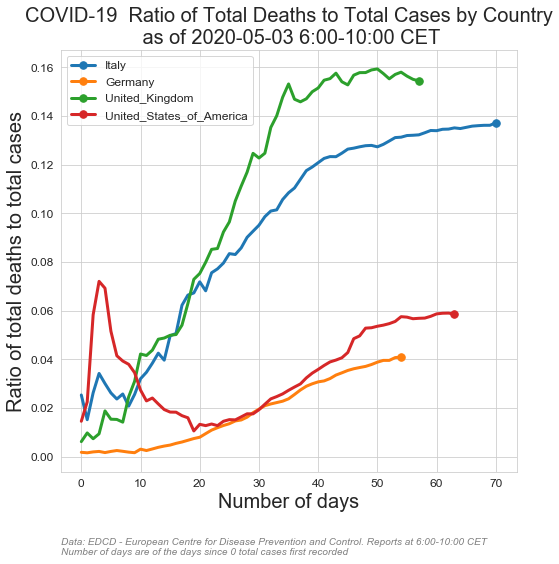

# COVID-19 Corona Pandemic DATA VISUALIZATION AND FORECASTING
# with time series models including
# -(Seasonal) Autoregressive integrated moving average
# -Holt-Winters Forecasting
# Country selection codes:
       #  'AFG', 'ALB', 'AND', 'DZA', 'AGO', nan, 'ATG', 'ARG', 'ARM', 'ABW',
       # 'AUS', 'AUT', 'AZE', 'BHS', 'BHR', 'BGD', 'BRB', 'BLR', 'BEL',
       # 'BLZ', 'BEN', 'BMU', 'BTN', 'BOL', 'BIH', 'BWA', 'BRA', 'VGB',
       # 'BRN', 'BGR', 'BFA', 'BDI', 'KHM', 'CMR', 'CAN', 'CPV', 'CYM',
       # 'CAF', 'TCD', 'CHL', 'CHN', 'COL', 'COG', 'CRI', 'CIV', 'HRV',
       # 'CUB', 'CUW', 'CYP', 'CZE', 'COD', 'DNK', 'DJI', 'DMA', 'DOM',
       # 'ECU', 'EGY', 'SLV', 'GNQ', 'ERI', 'EST', 'SWZ', 'ETH', 'FRO',
       # 'FJI', 'FIN', 'FRA', 'PYF', 'GAB', 'GMB', 'GEO', 'DEU', 'GHA',
       # 'GIB', 'GRC', 'GRL', 'GRD', 'GUM', 'GTM', 'GGY', 'GIN', 'GNB',
       # 'GUY', 'HTI', 'VAT', 'HND', 'HUN', 'ISL', 'IND', 'IDN', 'IRN',
       # 'IRQ', 'IRL', 'IMN', 'ISR', 'ITA', 'JAM', 'JPN', 'JEY', 'JOR',
       # 'KAZ', 'KEN', 'XKX', 'KWT', 'KGZ', 'LAO', 'LVA', 'LBN', 'LBR',
       # 'LBY', 'LIE', 'LTU', 'LUX', 'MDG', 'MWI', 'MYS', 'MDV', 'MLI',
       # 'MLT', 'MRT', 'MUS', 'MEX', 'MDA', 'MCO', 'MNG', 'MNE', 'MSR',
       # 'MAR', 'MOZ', 'MMR', 'NAM', 'NPL', 'NLD', 'NCL', 'NZL', 'NIC',
       # 'NER', 'NGA', 'MKD', 'MNP', 'NOR', 'OMN', 'PAK', 'PSE', 'PAN',
       # 'PNG', 'PRY', 'PER', 'PHL', 'POL', 'PRT', 'PRI', 'QAT', 'ROU',
       # 'RUS', 'RWA', 'KNA', 'LCA', 'VCT', 'SMR', 'SAU', 'SEN', 'SRB',
       # 'SYC', 'SLE', 'SGP', 'SXM', 'SVK', 'SVN', 'SOM', 'ZAF', 'KOR',
       # 'ESP', 'LKA', 'SDN', 'SUR', 'SWE', 'CHE', 'SYR', 'TWN', 'THA',
       # 'TLS', 'TGO', 'TTO', 'TUN', 'TUR', 'TCA', 'UGA', 'UKR', 'ARE',
       # 'GBR', 'TZA', 'USA', 'VIR', 'URY', 'UZB', 'VEN', 'VNM', 'ZMB',
       # 'ZWE','WORLD'    
      
# chart story selection list:
        # 'Total_cases'
        # 'Total_deaths'
        # 'Daily_cases'
        # 'Daily_deaths'
        # 'Daily_cases_MovAvg'
        # 'Daily_deaths_MovAvg'
        # 'Daily_cases_MovAvg_perPopulation'
        # 'Daily_deaths_MovAvg_perPopulation'
        #'Total_cases_perPopulation'
        #'Total_deaths_perPopulation'
        #'Daily_cases_perPopulation'
        #'Daily_deaths_perPopulation'
        #'Ratio_of_total_deaths_to_total_cases'
PubDate='2020-05-03' # pubdate of the data file by European Centre for Disease Prevention and Control
# original data link: https://www.ecdc.europa.eu/en/publications-data/download-todays-data-geographic-distribution-covid-19-cases-worldwide
forecast_flag=True  
forecast_mdl=['hwes','hwes','sarimax','hwes'] #options are ['hwes','sarimax']
loga=False #take log of data
plot_figures_flag=True
save_figures_flag=True
verbose=True
show_mdl_detail=False
mawindow=3 #moving average window size for smoothing charts
fdays=3 # number of steps forecasts (forward  time points) 
case_thr=10 # the day threshold that the first N cases recorded
deat_thr=3 # the day threshold that the first N deaths recorded
caseperpop_thr=0
deatperpop_thr=0
country_list=['ITA','DEU','GBR','USA']
 


```python
new_dict1=RUNcoviddatastory('Total_cases',PubDate,country_list,case_thr,mawindow,fdays,loga,forecast_flag,forecast_mdl,plot_figures_flag,save_figures_flag,verbose,show_mdl_detail)        
```

    ITA
    Total_cases
    2020-05-03    211245
    2020-05-04    213180
    2020-05-05    215133
    Freq: D, Name: hwes_model, dtype: int32
    DEU
    Total_cases
    2020-05-03    163671
    2020-05-04    164855
    2020-05-05    166048
    Freq: D, Name: hwes_model, dtype: int32
    GBR
    Total_cases
    2020-05-03    185769
    2020-05-04    188632
    2020-05-05    190221
    Freq: D, Name: sarimax_model, dtype: int32
    USA
    Total_cases
    2020-05-03    1165411
    2020-05-04    1198279
    2020-05-05    1232074
    Freq: D, Name: hwes_model, dtype: int32
    


```python
new_dict2=RUNcoviddatastory('Total_deaths',PubDate,country_list,deat_thr,mawindow,fdays,loga,forecast_flag,forecast_mdl,plot_figures_flag,save_figures_flag,verbose,show_mdl_detail)        

```

    ITA
    Total_deaths
    2020-05-03    29131
    2020-05-04    29577
    2020-05-05    30030
    Freq: D, Name: hwes_model, dtype: int32
    DEU
    Total_deaths
    2020-05-03    6782
    2020-05-04    6918
    2020-05-05    7057
    Freq: D, Name: hwes_model, dtype: int32
    GBR
    Total_deaths
    2020-05-03    28708
    2020-05-04    29270
    2020-05-05    29803
    Freq: D, Name: sarimax_model, dtype: int32
    USA
    Total_deaths
    2020-05-03    68228
    2020-05-04    70029
    2020-05-05    71877
    Freq: D, Name: hwes_model, dtype: int32
    


```python
new_dict3=RUNcoviddatastory('Ratio_of_total_deaths_to_total_cases',PubDate,country_list,caseperpop_thr,mawindow,fdays,loga,False,forecast_mdl,plot_figures_flag,save_figures_flag,verbose,show_mdl_detail)        
```





```python
new_dict4=RUNcoviddatastory('Total_cases_perPopulation',PubDate,country_list,caseperpop_thr,mawindow,fdays,loga,forecast_flag,forecast_mdl,plot_figures_flag,save_figures_flag,verbose,show_mdl_detail)        

```

    ITA
    Total_cases_perPopulation
    2020-05-03    3495
    2020-05-04    3527
    2020-05-05    3559
    Freq: D, Name: hwes_model, dtype: int32
    DEU
    Total_cases_perPopulation
    2020-05-03    1973
    2020-05-04    1987
    2020-05-05    2001
    Freq: D, Name: hwes_model, dtype: int32
    GBR
    Total_cases_perPopulation
    2020-05-03    2816
    2020-05-04    2890
    2020-05-05    2962
    Freq: D, Name: sarimax_model, dtype: int32
    USA
    Total_cases_perPopulation
    2020-05-03    3562
    2020-05-04    3662
    2020-05-05    3765
    Freq: D, Name: hwes_model, dtype: int32
    


```python
new_dict5=RUNcoviddatastory('Total_deaths_perPopulation',PubDate,country_list,deatperpop_thr,mawindow,fdays,loga,forecast_flag,forecast_mdl,plot_figures_flag,save_figures_flag,verbose,show_mdl_detail)        

```

    ITA
    Total_deaths_perPopulation
    2020-05-03    481
    2020-05-04    489
    2020-05-05    496
    Freq: D, Name: hwes_model, dtype: int32
    DEU
    Total_deaths_perPopulation
    2020-05-03    81
    2020-05-04    83
    2020-05-05    85
    Freq: D, Name: hwes_model, dtype: int32
    GBR
    Total_deaths_perPopulation
    2020-05-03    432
    2020-05-04    440
    2020-05-05    449
    Freq: D, Name: sarimax_model, dtype: int32
    USA
    Total_deaths_perPopulation
    2020-05-03    208
    2020-05-04    214
    2020-05-05    219
    Freq: D, Name: hwes_model, dtype: int32
    


```python
new_dict6=RUNcoviddatastory('Daily_cases',PubDate,country_list,case_thr,mawindow,fdays,loga,forecast_flag,forecast_mdl,plot_figures_flag,save_figures_flag,verbose,show_mdl_detail)        

```

    ITA
    Daily_cases
    2020-05-03    1853
    2020-05-04    1811
    2020-05-05    1769
    Freq: D, Name: hwes_model, dtype: int32
    DEU
    Daily_cases
    2020-05-03    1296
    2020-05-04    1253
    2020-05-05    1211
    Freq: D, Name: hwes_model, dtype: int32
    GBR
    Daily_cases
    2020-05-03    5235
    2020-05-04    5092
    2020-05-05    4897
    Freq: D, Name: sarimax_model, dtype: int32
    USA
    Daily_cases
    2020-05-03    30900
    2020-05-04    31484
    2020-05-05    32079
    Freq: D, Name: hwes_model, dtype: int32
    


```python
new_dict7=RUNcoviddatastory('Daily_deaths',PubDate,country_list,deat_thr,mawindow,fdays,loga,forecast_flag,forecast_mdl,plot_figures_flag,save_figures_flag,verbose,show_mdl_detail)        

```

    ITA
    Daily_deaths
    2020-05-03    356
    2020-05-04    372
    2020-05-05    390
    Freq: D, Name: hwes_model, dtype: int32
    DEU
    Daily_deaths
    2020-05-03    91
    2020-05-04    87
    2020-05-05    82
    Freq: D, Name: hwes_model, dtype: int32
    GBR
    Daily_deaths
    2020-05-03    650
    2020-05-04    600
    2020-05-05    661
    Freq: D, Name: sarimax_model, dtype: int32
    USA
    Daily_deaths
    2020-05-03    1831
    2020-05-04    1836
    2020-05-05    1842
    Freq: D, Name: hwes_model, dtype: int32
    


```python
new_dict8=RUNcoviddatastory('Daily_cases_perPopulation',PubDate,country_list,caseperpop_thr,mawindow,fdays,loga,forecast_flag,forecast_mdl,plot_figures_flag,save_figures_flag,verbose,show_mdl_detail)        

```

    ITA
    Daily_cases_perPopulation
    2020-05-03    30
    2020-05-04    29
    2020-05-05    29
    Freq: D, Name: hwes_model, dtype: int32
    DEU
    Daily_cases_perPopulation
    2020-05-03    17
    2020-05-04    16
    2020-05-05    16
    Freq: D, Name: hwes_model, dtype: int32
    GBR
    Daily_cases_perPopulation
    2020-05-03    76
    2020-05-04    73
    2020-05-05    72
    Freq: D, Name: sarimax_model, dtype: int32
    USA
    Daily_cases_perPopulation
    2020-05-03    94
    2020-05-04    95
    2020-05-05    96
    Freq: D, Name: hwes_model, dtype: int32
    


```python
new_dict9=RUNcoviddatastory('Daily_deaths_perPopulation',PubDate,country_list,deatperpop_thr,mawindow,fdays,loga,forecast_flag,forecast_mdl,plot_figures_flag,save_figures_flag,verbose,show_mdl_detail)        

```

    ITA
    Daily_deaths_perPopulation
    2020-05-03    5
    2020-05-04    6
    2020-05-05    6
    Freq: D, Name: hwes_model, dtype: int32
    DEU
    Daily_deaths_perPopulation
    2020-05-03    1
    2020-05-04    1
    2020-05-05    1
    Freq: D, Name: hwes_model, dtype: int32
    GBR
    Daily_deaths_perPopulation
    2020-05-03     9
    2020-05-04     9
    2020-05-05    10
    Freq: D, Name: sarimax_model, dtype: int32
    USA
    Daily_deaths_perPopulation
    2020-05-03    5
    2020-05-04    5
    2020-05-05    5
    Freq: D, Name: hwes_model, dtype: int32
    


```python
new_dict10=RUNcoviddatastory('Daily_cases_MovAvg',PubDate,country_list,case_thr,mawindow,fdays,loga,forecast_flag,forecast_mdl,plot_figures_flag,save_figures_flag,verbose,show_mdl_detail)        

```

    ITA
    Daily_cases_MovAvg
    2020-05-03    1852
    2020-05-04    1794
    2020-05-05    1737
    Freq: D, Name: hwes_model, dtype: int32
    DEU
    Daily_cases_MovAvg
    2020-05-03    1109
    2020-05-04    1092
    2020-05-05    1076
    Freq: D, Name: hwes_model, dtype: int32
    GBR
    Daily_cases_MovAvg
    2020-05-03    5621
    2020-05-04    5448
    2020-05-05    5379
    Freq: D, Name: sarimax_model, dtype: int32
    USA
    Daily_cases_MovAvg
    2020-05-03    32129
    2020-05-04    33231
    2020-05-05    34370
    Freq: D, Name: hwes_model, dtype: int32
    


```python
new_dict11=RUNcoviddatastory('Daily_deaths_MovAvg',PubDate,country_list,deat_thr,mawindow,fdays,loga,forecast_flag,forecast_mdl,plot_figures_flag,save_figures_flag,verbose,show_mdl_detail)        

```

    ITA
    Daily_deaths_MovAvg
    2020-05-03    358
    2020-05-04    374
    2020-05-05    390
    Freq: D, Name: hwes_model, dtype: int32
    DEU
    Daily_deaths_MovAvg
    2020-05-03    119
    2020-05-04    117
    2020-05-05    116
    Freq: D, Name: hwes_model, dtype: int32
    GBR
    Daily_deaths_MovAvg
    2020-05-03    716
    2020-05-04    699
    2020-05-05    655
    Freq: D, Name: sarimax_model, dtype: int32
    USA
    Daily_deaths_MovAvg
    2020-05-03    1797
    2020-05-04    1788
    2020-05-05    1779
    Freq: D, Name: hwes_model, dtype: int32
    


```python
new_dict12=RUNcoviddatastory('Daily_cases_MovAvg_perPopulation',PubDate,country_list,caseperpop_thr,mawindow,fdays,loga,forecast_flag,forecast_mdl,plot_figures_flag,save_figures_flag,verbose,show_mdl_detail)        

```

    ITA
    Daily_cases_MovAvg_perPopulation
    2020-05-03    30
    2020-05-04    29
    2020-05-05    28
    Freq: D, Name: hwes_model, dtype: int32
    DEU
    Daily_cases_MovAvg_perPopulation
    2020-05-03    13
    2020-05-04    13
    2020-05-05    13
    Freq: D, Name: hwes_model, dtype: int32
    GBR
    Daily_cases_MovAvg_perPopulation
    2020-05-03    84
    2020-05-04    82
    2020-05-05    81
    Freq: D, Name: sarimax_model, dtype: int32
    USA
    Daily_cases_MovAvg_perPopulation
    2020-05-03    95
    2020-05-04    96
    2020-05-05    98
    Freq: D, Name: hwes_model, dtype: int32
    


```python
new_dict13=RUNcoviddatastory('Daily_deaths_MovAvg_perPopulation',PubDate,country_list,deatperpop_thr,mawindow,fdays,loga,forecast_flag,forecast_mdl,plot_figures_flag,save_figures_flag,verbose,show_mdl_detail)        
```

    ITA
    Daily_deaths_MovAvg_perPopulation
    2020-05-03    5
    2020-05-04    6
    2020-05-05    6
    Freq: D, Name: hwes_model, dtype: int32
    DEU
    Daily_deaths_MovAvg_perPopulation
    2020-05-03    1
    2020-05-04    1
    2020-05-05    1
    Freq: D, Name: hwes_model, dtype: int32
    GBR
    Daily_deaths_MovAvg_perPopulation
    2020-05-03    9
    2020-05-04    9
    2020-05-05    9
    Freq: D, Name: sarimax_model, dtype: int32
    USA
    Daily_deaths_MovAvg_perPopulation
    2020-05-03    5
    2020-05-04    5
    2020-05-05    5
    Freq: D, Name: hwes_model, dtype: int32
    


```python

```

